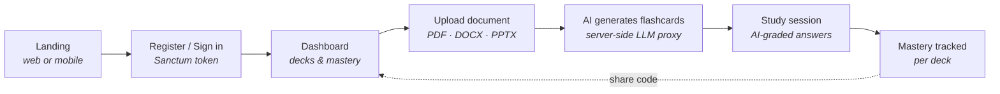
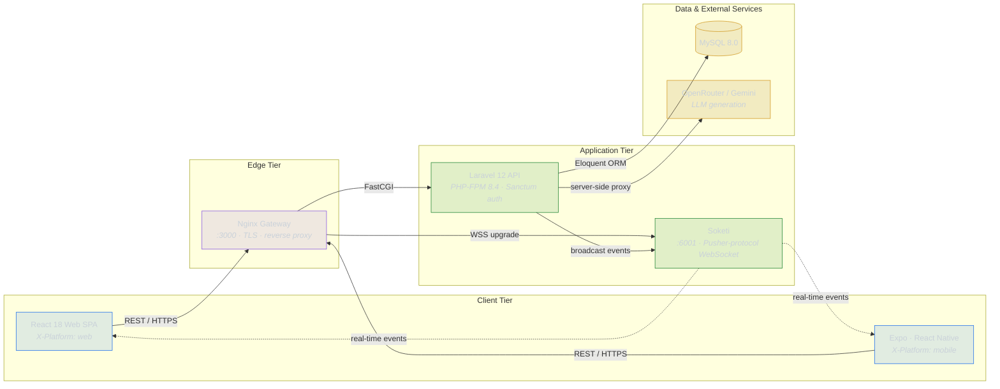

<div align="center">


# CogniVia

**AI-powered, cross-platform flashcard learning.**
Upload a document, get smart flashcards, and study them anywhere — web or mobile, in sync.

[](https://cogniviahq.vercel.app)
[](https://laravel.com)
[](https://php.net)
[](https://react.dev)
[](https://expo.dev)
[](https://www.docker.com)
[](LICENSE)

[**Live Demo**](https://cogniviahq.vercel.app) · [Screenshots](#screenshots--flow) · [Highlights](#highlights) · [Architecture](#architecture) · [Quick Start](#quick-start)

</div>

---

## Overview

CogniVia turns any document into an AI-generated flashcard deck and grades open-ended answers by **meaning, not string match**. A React web client and an Expo React Native app share one account and stay in sync in real time, while the Laravel API remains the single source of truth — the AI provider key never leaves the server.

---

## Screenshots & Flow

### Web — Landing


The public entry point: a marketing hero alongside an inline **sign-in** card. New users register, returning users sign in — authentication issues a platform-bound Sanctum token (`X-Platform: web`).

### Web — Dashboard


After signing in on the web, the learner is greeted by name and handed a **QR code to continue on mobile**, where the full study experience lives. Scanning carries the same account onto the Expo app — which is why a second sign-in runs through the cross-platform approval flow.

### Mobile — Onboarding & Auth

<div align="center">
<table>
  <tr>
    <td align="center"></td>
    <td width="28"></td>
    <td align="center"></td>
    <td width="28"></td>
    <td align="center"></td>
  </tr>
  <tr>
    <td align="center"><b>Landing</b><br/><sub>Start Your Journey</sub></td>
    <td width="28"></td>
    <td align="center"><b>Sign In</b><br/><sub>Returning learners</sub></td>
    <td width="28"></td>
    <td align="center"><b>Create Account</b><br/><sub>New learners</sub></td>
  </tr>
</table>
</div>

The Expo app opens to a guided onboarding carousel ending on a *Start Your Journey* screen that branches into **Sign In** and **Create Account**. It shares the same identity and API as the web client and follows the device's light/dark appearance. *(The in-app mobile dashboard is still under active development.)*

### The Flow



A learner signs in (approving the device if the account is active elsewhere), uploads a document that's parsed and turned into flashcards server-side, then studies a deck where open-ended answers are graded by AI for meaning. Each session updates per-deck mastery, and any deck can be re-shared via a unique share code.

---

## Highlights

| Area | What makes it interesting |
|---|---|
| **AI flashcard generation** | Upload PDF / DOCX / PPTX (≤ 10 MB); an OpenRouter / Gemini model generates 10–60 cards across five formats. The provider key is proxied server-side and never reaches a client. |
| **AI-graded study** | Open-ended answers are scored for *semantic* correctness by the LLM — verdict plus feedback — and per-deck mastery is tracked, marking decks *Mastered* (≥ 75%) or *Needs review*. |
| **Cross-platform login approval** | A sign-in from a new device must be approved from the active one: a real-time WebSocket event (fast path) backed by authoritative HTTP polling (fallback), surviving tunnels and backgrounded tabs. Approval tokens are high-entropy, SHA-256-hashed, and single-use. |
| **Platform-bound tokens** | Sanctum tokens are scoped to their issuing platform (`web` / `mobile`); middleware rejects cross-platform reuse, and user / admin sessions live in fully separate namespaces. |
| **Real-time, reconciled** | Profile and session changes sync instantly via Soketi + Laravel Echo — but every event is treated as a signal and confirmed over authenticated HTTPS, so a dropped or spoofed message can't desync state. |
| **Deck sharing** | Every deck carries a unique `FC-XXXXXXXX` share code; importing clones the full deck into your account with a fresh code, safely tracked back to the original. |
| **Admin console** | KPIs, user lifecycle (soft-delete / restore / purge with a trash view), engagement analytics, a login-approval monitor, and CSV export. |
| **Production-minded ops** | One-command Docker Compose stack (PHP-FPM · Nginx · MySQL · Soketi), Controller → Service → Repository layering, and a side-effect-free DB warm-up that keeps a free-tier database from cold-starting the first login. |

---

## Tech Stack

| Layer | Technology |
|---|---|
| Backend | Laravel 12 · PHP 8.4 · Laravel Sanctum · Laravel Echo |
| AI / LLM | OpenRouter API · Google Gemini (server-side proxy) |
| Web | React 18 · React Router · Axios · ApexCharts |
| Mobile | Expo SDK 54 · React Native · Expo Secure Store |
| Data & realtime | MySQL 8.0 · Soketi (Pusher-compatible WebSocket) |
| Infrastructure | Docker · Docker Compose · Nginx |
| Deployment | Vercel (web) · Render (API) · Aiven (MySQL) · Pusher (real-time) |

---

## Architecture

The backend is the single source of truth. Clients authenticate against the Laravel API over HTTPS; document parsing and AI generation run entirely server-side, and real-time events are broadcast via Soketi and consumed by Laravel Echo — always reconciled against authenticated endpoints.



---

## Quick Start

**Prerequisites:** Docker & Docker Compose · Node.js 18+ · [Expo Go](https://expo.dev/go) (to preview mobile).

```bash
git clone https://github.com/ijanvincent/cognivia.git && cd cognivia
cp backend/.env.example backend/.env

docker compose up -d                                    # PHP-FPM · Nginx · MySQL · Soketi
docker exec cognivia_backend php artisan key:generate
docker exec cognivia_backend php artisan migrate --seed
docker exec cognivia_backend php artisan storage:link

cd frontend && npm install && npm start                 # web    → http://localhost:3000
cd ../mobile && npm install && npx expo start --tunnel  # mobile → scan with Expo Go
```

Full setup, environment variables, and command reference live in **[CONTRIBUTING.md](CONTRIBUTING.md)**.

---

## Documentation

| Document | What's in it |
|---|---|
| [CONTRIBUTING](CONTRIBUTING.md) | Setup, env vars, branching, commits, testing, and the PR process |
| [DEPLOYMENT](DEPLOYMENT.md) | Hosting setup — Vercel, Render, Aiven, Pusher |
| [SCALING](SCALING.md) | Production-readiness roadmap and the free → paid upgrade path |

---

## Contributing

Contributions are welcome. Branch from an up-to-date `main` (`type/short-description`), keep PHP **PSR-12-clean** (`./vendor/bin/pint`) and the suite green (`php artisan test`), follow [Conventional Commits](https://www.conventionalcommits.org/), and open a pull request into `main`. See **[CONTRIBUTING.md](CONTRIBUTING.md)** for the full workflow — `main` never receives direct commits.

---

## License

Released under the [MIT License](LICENSE).

---

<div align="center">
  <sub>Built with Laravel · React · React Native · Soketi · Docker</sub><br/>
  <sub><a href="https://cogniviahq.vercel.app">cogniviahq.vercel.app</a></sub>
</div>
