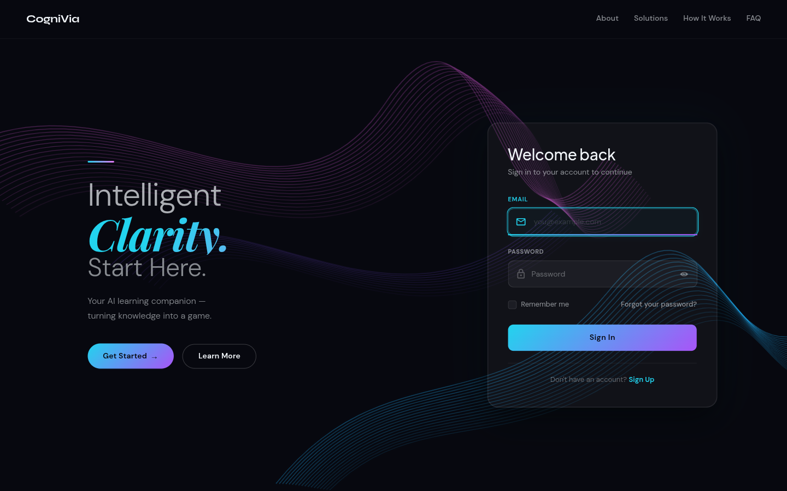
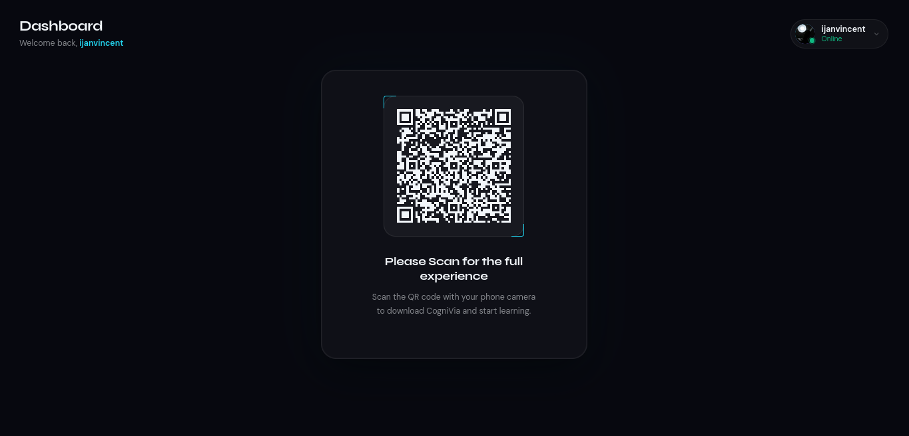
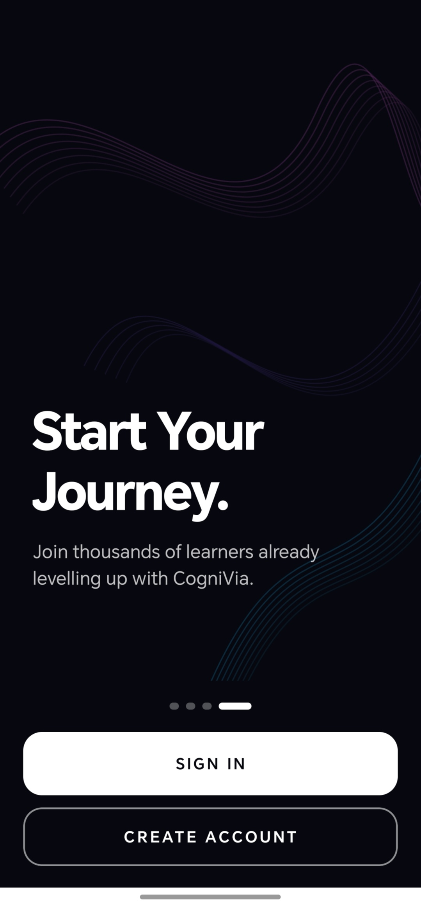
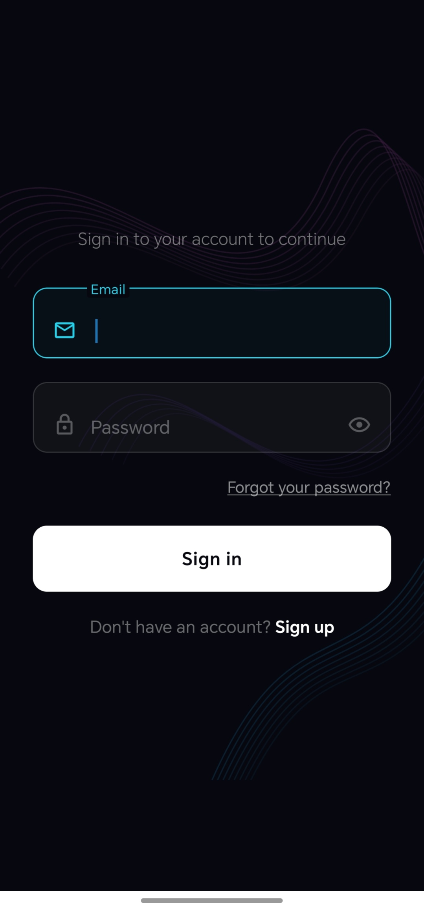
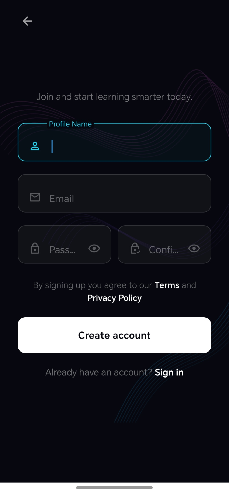
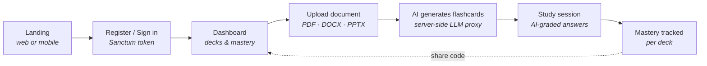
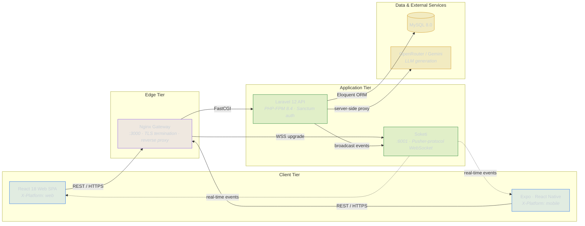

<div align="center">


# CogniVia

**AI-powered, cross-platform flashcard learning.**
Upload a document, get smart flashcards, and study them anywhere — web or mobile, in sync.

[](https://cogniviahq.vercel.app)
[](https://laravel.com)
[](https://php.net)
[](https://react.dev)
[](https://expo.dev)
[](https://www.docker.com)
[](LICENSE)
[](CONTRIBUTING.md)

[**Live Demo**](https://cogniviahq.vercel.app) · [Architecture](#architecture) · [Getting Started](#getting-started) · [Contributing](CONTRIBUTING.md)

</div>

---

> A full-stack, cross-platform learning system — Laravel 12 API, React web client, Expo React Native mobile app, an LLM-backed flashcard pipeline, AI-graded study sessions, real-time WebSocket events, and a fully Dockerized local environment.

## Table of Contents

- [Overview](#overview)
- [Screenshots & Flow](#screenshots--flow)
- [Features](#features)
- [Engineering Highlights](#engineering-highlights)
- [Tech Stack](#tech-stack)
- [Repository Structure](#repository-structure)
- [Architecture](#architecture)
- [Authentication Model](#authentication-model)
- [Cross-Platform Login Approval](#cross-platform-login-approval)
- [Getting Started](#getting-started)
- [Environment Variables](#environment-variables)
- [Common Commands](#common-commands)
- [Development Workflow](#development-workflow)
- [Testing & Code Quality](#testing--code-quality)
- [Security Principles](#security-principles)
- [Pre-merge Checklist](#pre-merge-checklist)
- [Documentation](#documentation)
- [Contributing](#contributing)
- [License](#license)

---

## Overview

CogniVia is an AI-powered flashcard learning platform that works seamlessly across web and mobile. Users upload a document (PDF, DOCX, or PPTX); the backend parses it, extracts the text, and uses an LLM (OpenRouter / Google Gemini) to generate study-ready flashcards in several formats. Learners then study those cards in interactive sessions where **open-ended answers are graded by AI**, not by string matching, and their **mastery is tracked per deck**.

Decks are shareable: every deck carries a unique **share code** that anyone can use to import a full copy into their own account. One account spans both platforms, and **profiles and sessions stay in sync in real time** over WebSockets. A separate admin console provides analytics, user lifecycle management, and engagement insights.

The backend is the single source of truth: every client authenticates against the Laravel API over HTTPS, the AI provider key never leaves the server, and real-time messages are treated as signals that are always reconciled against authenticated endpoints.

---

## Screenshots & Flow

### Web — Landing



The public entry point. A visitor lands on the marketing hero (with **About / Solutions / How It Works / FAQ** navigation) alongside an inline **sign-in** card. New users tap **Get Started** to register; returning users sign in directly. Authentication runs against the Laravel API and issues a platform-bound Sanctum token (`X-Platform: web`).

### Web — Dashboard



After signing in on the web, the learner is greeted by name and handed a **QR code to continue on mobile** — where the full study experience (document upload, AI generation, and graded study sessions) lives. The header shows live presence (*Online*), and scanning the code carries the same account onto the Expo app, which is why a second sign-in there runs through the cross-platform approval flow.

### Mobile — Onboarding & Auth

<div align="center">
<table>
  <tr>
    <td align="center"></td>
    <td width="28"></td>
    <td align="center"></td>
    <td width="28"></td>
    <td align="center"></td>
  </tr>
  <tr>
    <td align="center"><b>Landing</b><br/><sub>Start Your Journey</sub></td>
    <td width="28"></td>
    <td align="center"><b>Sign In</b><br/><sub>Returning learners</sub></td>
    <td width="28"></td>
    <td align="center"><b>Create Account</b><br/><sub>New learners</sub></td>
  </tr>
</table>
</div>

The Expo React Native app opens to a guided **onboarding carousel** ending on a *Start Your Journey* screen, which branches into **Sign In** and **Create Account**. It shares the same identity and API as the web client — one account spans both platforms, theming follows the device appearance, and signing in here triggers the cross-platform approval flow if the account is already active on the web. *(The in-app mobile dashboard is still under active development.)*

### The Flow



1. **Landing → Auth.** From the landing page (web or mobile) a user registers or signs in. The backend issues a platform-bound token; if the account is already active elsewhere, the new sign-in must be **approved from the active device**.
2. **Dashboard / handoff.** On the web, the dashboard hands the learner a **QR code to continue on mobile**, where the study experience lives. On mobile, the dashboard shows their decks and mastery and lets them import a deck by **share code** or create a new one.
3. **Upload → Generate.** A document (PDF, DOCX, or PPTX) is parsed server-side, and an LLM generates study-ready flashcards. The AI provider key never leaves the backend.
4. **Study → Grade.** In a study session, open-ended answers are graded by AI for *meaning*, not string match, returning a verdict plus feedback.
5. **Track → Share.** Each session updates per-deck mastery, and any deck can be re-shared via its unique share code — looping a new learner back to the dashboard.

---

## Features

### AI-Powered Flashcard Generation
- **Document ingestion** — upload **PDF, DOCX, or PPTX** files (up to 10 MB); the backend extracts the text server-side.
- **LLM generation** — flashcards are generated through an **OpenRouter / Google Gemini** model. The provider key lives **only** on the backend; clients call the Laravel API, never the AI provider directly.
- **Configurable decks** — choose how many cards to generate (10–60 per deck).
- **Five card formats** — *Identification*, *Multiple Choice*, *True / False*, *Explanatory*, and *Mixed*.

### Interactive Study & AI Grading
- **Study sessions** — work through a deck in a shuffled order with a live progress bar and running score.
- **AI-graded answers** — open-ended responses are evaluated for **meaning** by the LLM (not exact-string match), returning a correct/incorrect verdict plus natural-language feedback.
- **Multiple interaction modes** — multiple-choice, true/false, and free-recall identification.
- **Mastery tracking** — each session computes a mastery percentage, marks the deck *Mastered* (≥ 75%) or *Needs Review*, and offers a reshuffled **Study Again** retry.
- **Session review** — an end-of-session summary breaks down performance card by card.

### Deck Sharing via Share Codes
- **Unique share code per deck** — every deck is assigned a code in the form `FC-XXXXXXXX`.
- **Native sharing (mobile)** — share a deck's code straight from the OS share sheet.
- **Import by code** — entering a share code clones the full deck (and all its flashcards) into your own account.
- **Safe-by-design copies** — you can't import your own deck or import the same deck twice; each imported copy gets a **fresh share code** so recipients can re-share their own version. Imports are tracked back to the original deck.

### Progress & Insights
- **Mobile progress dashboard** — overall mastery, total cards, cards mastered, decks needing review, and your strongest deck.
- **Per-deck ranking** — decks sorted by mastery with strength labels (*Strong / Improving / Needs review*).
- **Near-real-time dashboard** — newly generated decks and updated mastery appear automatically while a screen is focused.

### Cross-Platform Accounts & Real-Time Sync
- **One account, two clients** — a React web app and an Expo React Native app share a single API and identity.
- **Live profile sync** — username/avatar changes propagate across devices instantly via **Soketi (Pusher protocol) + Laravel Echo**.
- **Cross-platform login approval** — signing in on a second device must be **approved from the already-active device**, combining a real-time event with an authoritative polling fallback.
- **Remote force-logout** — sessions can be terminated and the affected client is signed out in real time.

### Security & Authentication
- **Token auth (Sanctum)** — stateless API tokens with **fully separate user and admin namespaces**.
- **Platform-bound tokens** — every request carries `X-Platform: web|mobile`, and middleware rejects a token used on the wrong platform.
- **Rate-limited endpoints** — login, registration, password reset, and approval routes are throttled.
- **Hardened secrets** — login-approval tokens are high-entropy, stored only as SHA-256 hashes, and single-use; mobile session tokens live in `expo-secure-store`; the AI provider key never leaves the backend.
- **Password reset by email** — with a custom **Gmail API mail transport** fallback for hosts where outbound SMTP is blocked.

### Admin Console
- **Dashboard KPIs** — platform-wide user and content metrics.
- **User lifecycle management** — list, inspect, **soft-delete, restore, and permanently delete** users, with a dedicated trash view.
- **Engagement analytics** — activity feed and engagement breakdowns.
- **Content oversight** — deck/content overview and a login-approval monitor.
- **CSV export** — export user lists for offline analysis.

### Mobile Experience
- **Expo SDK 54 / React Native** — native iOS and Android from one codebase.
- **System-aware theming** — light/dark mode that follows the device appearance.
- **Offline awareness** — connectivity is detected and surfaced; cached profile data persists when offline.
- **Polished onboarding** — splash, onboarding, and guided auth flows.

### Platform & DevOps
- **One-command local stack** — Docker Compose brings up PHP-FPM, Nginx, MySQL, and Soketi together.
- **Production deployment** — web on **Vercel**, API on **Render**, MySQL on **Aiven**, real-time on **Pusher**.
- **Operational resilience** — a side-effect-free DB warm-up endpoint keeps the free-tier database from cold-starting on first login.

---

## Engineering Highlights

A few parts of CogniVia that were the most interesting to design and build:

- **AI grading instead of string matching.** Open-ended answers are scored for *semantic* correctness by the LLM, which returns a verdict plus feedback. The provider key is proxied entirely server-side, so it never reaches a client.
- **Cross-platform login approval.** A sign-in from a new device must be authorized from the already-active device. It combines a real-time WebSocket event (fast path) with authoritative HTTP polling (fallback), so the flow survives flaky mobile networks, tunnels, and backgrounded browser tabs. Approval tokens are high-entropy, stored only as SHA-256 hashes, and single-use.
- **Platform-bound tokens.** Each token is scoped to the platform that issued it (`web` / `mobile`); middleware rejects cross-platform reuse, and user/admin sessions live in fully separate namespaces to prevent privilege bleed.
- **Real-time as a signal, never as truth.** Every WebSocket event is reconciled against an authenticated HTTP endpoint, so a dropped, delayed, or spoofed message can't desync application state.
- **Clean layering.** The backend follows a Controller → Service → Repository structure with form-request validation, keeping transport, business logic, and persistence cleanly separated and testable.
- **Production-ready operations.** Docker Compose gives local/prod parity, and a side-effect-free DB warm-up endpoint keeps a free-tier database from cold-starting the first login.

---

## Tech Stack

| Layer | Technology |
|---|---|
| Backend | Laravel 12 · PHP 8.4 · Laravel Sanctum · Laravel Echo · Soketi |
| AI / LLM | OpenRouter API · Google Gemini (server-side proxy) |
| Document parsing | PDF, DOCX, and PPTX text extraction (server-side) |
| Web | React 18 · React Router · Axios · ApexCharts · FullCalendar |
| Mobile | Expo SDK 54 · React Native · Expo Secure Store |
| Database | MySQL 8.0 |
| Gateway | Nginx (Alpine) |
| Real-time | Soketi (Pusher-compatible WebSocket server) |
| Infrastructure | Docker · Docker Compose |
| Deployment | Vercel (web) · Render (API) · Aiven (MySQL) · Pusher (real-time) |

---

## Repository Structure

```
cognivia/
├── backend/             # Laravel 12 API — auth, business logic, broadcasting
├── frontend/            # React web app — user dashboard, admin panel, public pages
├── mobile/              # Expo React Native app — mobile learning & login approval
├── docker/              # Nginx config, PHP-FPM config, Docker assets
├── docker-compose.yml   # Local dev stack — backend, nginx, mysql, soketi
└── ngrok.yml            # Tunnel config for mobile development
```

---

## Architecture

The backend is the single source of truth. All clients authenticate against the Laravel API and communicate over HTTPS. Document parsing and AI flashcard generation happen entirely server-side — the OpenRouter/Gemini API key never leaves the backend. Real-time events are broadcast via Soketi (Pusher protocol) and consumed by Laravel Echo on the web and mobile clients.



> **Request lifecycle.** Clients never talk to the database or the LLM provider directly. Every call enters through the Nginx gateway, is authenticated by Sanctum, and is served by the Laravel API — the single source of truth. Document parsing and AI flashcard generation run entirely server-side, so the OpenRouter/Gemini key never reaches a client bundle. State changes are pushed back to clients as fire-and-forget real-time events (dotted lines), but clients always confirm authoritative state over HTTPS.

**Local service endpoints:**

| Service | URL |
|---|---|
| Nginx gateway (API + Web) | `http://localhost:3000` |
| Soketi WebSocket | `ws://localhost:6001` |
| Soketi metrics | `http://localhost:9601` |
| MySQL | `localhost:3307` |

---

## Authentication Model

CogniVia strictly separates user and admin sessions:

- **User tokens** are stored under user-namespaced storage keys (`user_token`, `user_data`)
- **Admin tokens** are stored under admin-namespaced storage keys (`admin_token`, `admin_data`)
- Separate middleware groups (`auth:sanctum` + role checks) protect each route group
- The `X-Platform` header identifies the requesting client (`web` or `mobile`)
- A token issued for one platform cannot silently act as another

---

## Cross-Platform Login Approval

When a user is already signed in on one platform and attempts to sign in on another:

1. The backend creates a short-lived `PendingLogin` record
2. The already-active platform receives a sign-in approval request via real-time event
3. The active platform approves or denies the request
4. The requesting platform receives the result and — if approved — exchanges it for its own session token

**Reliability:** real-time events (fast path) and HTTP polling (fallback) run in parallel so the flow survives tunnels, mobile networks, and backgrounded browser tabs.

**Security properties:**
- Approval tokens are high-entropy random values
- Only the SHA-256 hash is stored in the database
- Each approval record is single-use and short-lived

Relevant files: `PendingLogin`, `LoginApprovalController`, `NewLoginRequest` / `LoginApproved` / `LoginDenied` events, `AuthService`.

---

## Getting Started

### Prerequisites

- Docker & Docker Compose
- Node.js 18+
- Expo tooling — run via `npx expo` (no global install needed); the [Expo Go](https://expo.dev/go) app on a physical device to preview the mobile client

### 1. Clone and configure

```bash
git clone https://github.com/ijanvincent/cognivia.git
cd cognivia
cp backend/.env.example backend/.env
```

Fill in your `.env` values (see [Environment Variables](#environment-variables)).

### 2. Start backend infrastructure

```bash
docker compose up -d
```

Run migrations and seed:

```bash
docker exec cognivia_backend php artisan key:generate
docker exec cognivia_backend php artisan migrate --seed
docker exec cognivia_backend php artisan storage:link
```

### 3. Start the web app

```bash
cd frontend
npm install
npm start
```

The app is served via Nginx at `http://localhost:3000`.

### 4. Start the mobile app

```bash
cd mobile
npm install
npx expo start --tunnel --clear
```

Scan the QR code with Expo Go on a physical device.

---

## Environment Variables

| Variable | Where | Description |
|---|---|---|
| `DB_*` | `backend/.env` | MySQL connection settings |
| `APP_KEY` | `backend/.env` | Laravel application key |
| `SANCTUM_*` | `backend/.env` | Session / token config |
| `PUSHER_APP_ID` | `backend/.env` | Soketi app ID |
| `PUSHER_APP_KEY` | `backend/.env` + `frontend/.env` | Soketi app key |
| `PUSHER_APP_SECRET` | `backend/.env` | Soketi app secret |
| `REACT_APP_API_URL` | `frontend/.env` | Web client API base URL |
| `EXPO_PUBLIC_API_URL` | `mobile/.env` | Mobile client API base URL |

> **Never commit real credentials, production tokens, secrets, or tunnel URLs.** Every `.env` file is gitignored; commit only the `.env.example` templates.

---

## Common Commands

**Docker:**

```bash
# Start / stop all services
docker compose up -d
docker compose down

# Shell into the backend container
docker exec -it cognivia_backend bash
```

**Laravel (run inside the container):**

```bash
php artisan migrate
php artisan migrate:fresh --seed
php artisan optimize:clear
php artisan route:list
php artisan storage:link
php artisan test                  # run the test suite
./vendor/bin/pint                 # format to PSR-12
```

**Frontend:**

```bash
npm start        # development server
npm run build    # production build
```

**Mobile:**

```bash
npx expo start --tunnel --clear   # physical device via ngrok tunnel
npx expo start                    # local network
```

---

## Development Workflow

`main` is a protected, release-ready branch — it never receives direct commits.

- **Branch per change.** All work happens on a feature branch (e.g. `feature/admin-analytics`, `fix/login-race`, `docs/readme-polish`), then merges to `main` through a reviewed pull request.
- **Server-side enforcement.** A GitHub ruleset on `main` requires a pull request, blocks force-pushes and deletions, and enforces linear history.
- **Local guardrails.** Git hooks block accidental direct commits/pushes to `main` before they ever reach the remote.
- **Style.** PHP follows PSR-12 (enforced by Laravel Pint); the web and mobile apps use functional React components and hooks throughout.

```bash
git switch -c feature/my-change   # start work
# ...commit on the feature branch...
git push -u origin feature/my-change
# open a pull request into main
```

---

## Testing & Code Quality

```bash
docker exec cognivia_backend php artisan test     # run the backend test suite
docker exec cognivia_backend ./vendor/bin/pint    # format / lint PHP to PSR-12
```

- **Backend tests** run on PHPUnit via `php artisan test`.
- **Static style** is enforced with **Laravel Pint** (PSR-12).
- **Linear, reviewed history** — every change lands through a pull request into a protected `main` (see [Development Workflow](#development-workflow)).

---

## Security Principles

- Validate all client input at the API boundary — never trust client-side checks alone
- Keep credentials and secrets out of version control
- Use least-privilege tokens with platform-aware authorization
- Store approval tokens as hashes, never plaintext
- Treat real-time events as convenience signals; use authenticated HTTP endpoints for authoritative state

---

## Pre-merge Checklist

Before merging authentication or real-time changes, verify:

```bash
docker exec cognivia_backend php -l routes/api.php
docker exec cognivia_backend php -l app/Services/Auth/AuthService.php
docker exec cognivia_backend php artisan route:list
```

Manual smoke tests:

- [ ] User login on web
- [ ] User login on mobile
- [ ] Admin login
- [ ] Profile update reflects on dashboard immediately
- [ ] Web active → mobile requests login → web approves
- [ ] Mobile active → web requests login → mobile approves
- [ ] Deny flow clears without requiring a page refresh

---

## Documentation

| Document | What's in it |
|---|---|
| [README](README.md) | Project overview, architecture, setup, command reference |
| [CONTRIBUTING](CONTRIBUTING.md) | How to set up, branch, commit, test, and open a PR |
| [DEPLOYMENT](DEPLOYMENT.md) | Hosting setup — Vercel, Render, Aiven, Pusher |
| [SCALING](SCALING.md) | Production-readiness roadmap and the free→paid upgrade path |

---

## Contributing

Contributions are welcome — bug reports, features, and documentation fixes alike.

Start with the **[Contributing Guide](CONTRIBUTING.md)**, which covers the full
workflow. The essentials:

- Branch from an up-to-date `main` (`type/short-description`, e.g. `feature/deck-export`); **never commit to `main` directly**.
- Follow [Conventional Commits](https://www.conventionalcommits.org/) (`type(scope): summary`).
- Keep PHP **PSR-12-clean** (`./vendor/bin/pint`) and the suite green (`php artisan test`).
- Open a pull request into `main` and fill out the PR template; a maintainer will review.

New here? Issues labelled **good first issue** are a great place to start. For
anything large or architectural, open an issue to discuss the approach first.

---

## License

Released under the [MIT License](LICENSE).

---

---

<div align="center">
  <sub>Built with Laravel · React · React Native · Soketi · Docker</sub><br/>
  <sub><a href="https://cogniviahq.vercel.app">cogniviahq.vercel.app</a></sub>
</div>
