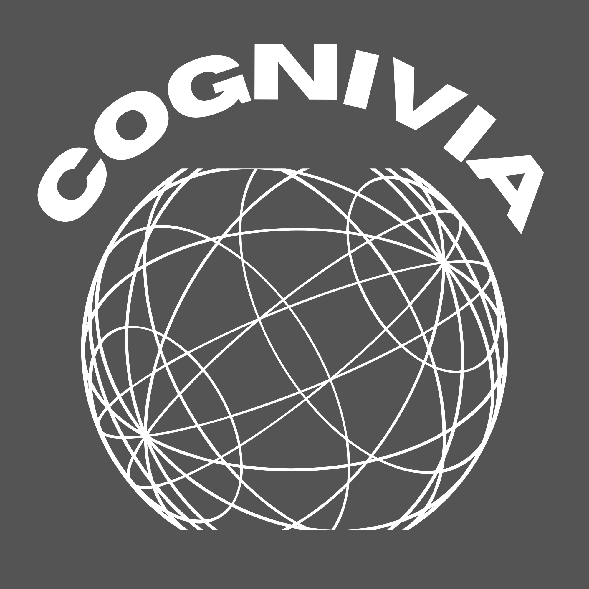

<div align="center">



# CogniVia

**AI-powered, cross-platform flashcard learning.**
Upload a document, get smart flashcards, and study them anywhere — web or mobile, in sync.

[](https://cogniviahq.vercel.app)
[](https://laravel.com)
[](https://php.net)
[](https://react.dev)
[](https://expo.dev)
[](https://www.docker.com)

[**Live Demo**](https://cogniviahq.vercel.app) · [Architecture](#architecture) · [Getting Started](#getting-started) · [Development Workflow](#development-workflow)

</div>

---

> A full-stack, cross-platform learning system — Laravel 12 API, React web client, Expo React Native mobile app, real-time WebSocket events, and a fully Dockerized local environment.

## Table of Contents

- [Overview](#overview)
- [Features](#features)
- [Tech Stack](#tech-stack)
- [Repository Structure](#repository-structure)
- [Architecture](#architecture)
- [Authentication Model](#authentication-model)
- [Cross-Platform Login Approval](#cross-platform-login-approval)
- [Getting Started](#getting-started)
- [Environment Variables](#environment-variables)
- [Common Commands](#common-commands)
- [Development Workflow](#development-workflow)
- [Security Principles](#security-principles)
- [Pre-merge Checklist](#pre-merge-checklist)
- [License](#license)
- [Author](#author)

---

## Overview

CogniVia is an AI-powered flashcard learning platform that works seamlessly across web and mobile. Users upload documents (PDF, DOCX, PPTX), the backend parses them and generates smart flashcards via an LLM (OpenRouter/Gemini), and users study those flashcards on any device. Profiles stay in sync across platforms through real-time WebSocket events. Admins get a full management dashboard with analytics, user management, and CSV exports.

The backend is the single source of truth: every client authenticates against the Laravel API over HTTPS, and the AI provider key never leaves the server.

---

## Features

- 📄 **Document-to-flashcards** — upload PDF, DOCX, or PPTX; the backend parses the file and generates study cards with an LLM.
- 🤖 **Server-side AI** — the OpenRouter/Gemini key lives only on the backend; clients never call the AI provider directly.
- 📱 **True cross-platform** — a React web app and an Expo React Native app share one API and one account.
- 🔄 **Real-time sync** — profile and study state propagate instantly via Soketi (Pusher-protocol) WebSockets.
- 🔐 **Cross-platform login approval** — signing in on a second device is approved from the active one, with a polling fallback.
- 🛡️ **Platform-aware auth** — separate user/admin sessions and per-platform tokens enforced by middleware.
- 📊 **Admin dashboard** — analytics, user management, and CSV exports.
- 🐳 **One-command local stack** — Docker Compose brings up PHP, Nginx, MySQL, and Soketi together.

---

## Tech Stack

| Layer | Technology |
|---|---|
| Backend | Laravel 12 · PHP 8.4 · Laravel Sanctum · Laravel Echo · Soketi |
| Web | React 18 · React Router · Axios · ApexCharts · FullCalendar |
| Mobile | Expo SDK 54 · React Native · Expo Secure Store |
| Database | MySQL 8.0 |
| Gateway | Nginx (Alpine) |
| Real-time | Soketi (Pusher-compatible WebSocket server) |
| Infrastructure | Docker · Docker Compose |

---

## Repository Structure

```
cognivia/
├── backend/             # Laravel 12 API — auth, business logic, broadcasting
├── frontend/            # React web app — user dashboard, admin panel, public pages
├── mobile/              # Expo React Native app — mobile learning & login approval
├── docker/              # Nginx config, PHP-FPM config, Docker assets
├── docker-compose.yml   # Local dev stack — backend, nginx, mysql, soketi
└── ngrok.yml            # Tunnel config for mobile development
```

---

## Architecture

The backend is the single source of truth. All clients authenticate against the Laravel API and communicate over HTTPS. Document parsing and AI flashcard generation happen entirely server-side — the OpenRouter/Gemini API key never leaves the backend. Real-time events are broadcast via Soketi (Pusher protocol) and consumed by Laravel Echo on the web and mobile clients.

```
┌─────────────┐     ┌─────────────┐
│  React Web  │     │ Expo Mobile │
└──────┬──────┘     └──────┬──────┘
       │  HTTPS + WS       │
       ▼                   ▼
┌─────────────────────────────────┐
│           Nginx Gateway         │  :3000
└────────┬──────────┬─────────────┘
         │          │
         ▼          ▼
┌──────────────┐  ┌────────────┐
│  Laravel API │  │   Soketi   │  :6001
│  (PHP-FPM)   │  │ (WebSocket)│
└──────┬───────┘  └────────────┘
       │
       ▼
┌──────────────┐
│   MySQL 8.0  │  :3306
└──────────────┘
```

**Local service endpoints:**

| Service | URL |
|---|---|
| Nginx gateway (API + Web) | `http://localhost:3000` |
| Soketi WebSocket | `ws://localhost:6001` |
| Soketi metrics | `http://localhost:9601` |
| MySQL | `localhost:3307` |

---

## Authentication Model

CogniVia strictly separates user and admin sessions:

- **User tokens** are stored under user-namespaced storage keys (`user_token`, `user_data`)
- **Admin tokens** are stored under admin-namespaced storage keys (`admin_token`, `admin_data`)
- Separate middleware groups (`auth:sanctum` + role checks) protect each route group
- The `X-Platform` header identifies the requesting client (`web` or `mobile`)
- A token issued for one platform cannot silently act as another

---

## Cross-Platform Login Approval

When a user is already signed in on one platform and attempts to sign in on another:

1. The backend creates a short-lived `PendingLogin` record
2. The already-active platform receives a sign-in approval request via real-time event
3. The active platform approves or denies the request
4. The requesting platform receives the result and — if approved — exchanges it for its own session token

**Reliability:** real-time events (fast path) and HTTP polling (fallback) run in parallel so the flow survives tunnels, mobile networks, and backgrounded browser tabs.

**Security properties:**
- Approval tokens are high-entropy random values
- Only the SHA-256 hash is stored in the database
- Each approval record is single-use and short-lived

Relevant files: `PendingLogin`, `LoginApprovalController`, `NewLoginRequest` / `LoginApproved` / `LoginDenied` events, `AuthService`.

---

## Getting Started

### Prerequisites

- Docker & Docker Compose
- Node.js 18+
- Expo CLI (`npm install -g expo-cli`)

### 1. Clone and configure

```bash
git clone https://github.com/ijanvincent/cognivia.git
cd cognivia
cp backend/.env.example backend/.env
```

Fill in your `.env` values (see [Environment Variables](#environment-variables)).

### 2. Start backend infrastructure

```bash
docker compose up -d
```

Run migrations and seed:

```bash
docker exec cognivia_backend php artisan key:generate
docker exec cognivia_backend php artisan migrate --seed
docker exec cognivia_backend php artisan storage:link
```

### 3. Start the web app

```bash
cd frontend
npm install
npm start
```

The app is served via Nginx at `http://localhost:3000`.

### 4. Start the mobile app

```bash
cd mobile
npm install
npx expo start --tunnel --clear
```

Scan the QR code with Expo Go on a physical device.

---

## Environment Variables

| Variable | Where | Description |
|---|---|---|
| `DB_*` | `backend/.env` | MySQL connection settings |
| `APP_KEY` | `backend/.env` | Laravel application key |
| `SANCTUM_*` | `backend/.env` | Session / token config |
| `PUSHER_APP_ID` | `backend/.env` | Soketi app ID |
| `PUSHER_APP_KEY` | `backend/.env` + `frontend/.env` | Soketi app key |
| `PUSHER_APP_SECRET` | `backend/.env` | Soketi app secret |
| `REACT_APP_API_URL` | `frontend/.env` | Web client API base URL |
| `EXPO_PUBLIC_API_URL` | `mobile/.env` | Mobile client API base URL |

> **Never commit real credentials, production tokens, secrets, or tunnel URLs.** Every `.env` file is gitignored; commit only the `.env.example` templates.

---

## Common Commands

**Docker:**

```bash
# Start / stop all services
docker compose up -d
docker compose down

# Shell into the backend container
docker exec -it cognivia_backend bash
```

**Laravel (run inside the container):**

```bash
php artisan migrate
php artisan migrate:fresh --seed
php artisan optimize:clear
php artisan route:list
php artisan storage:link
php artisan test                  # run the test suite
./vendor/bin/pint                 # format to PSR-12
```

**Frontend:**

```bash
npm start        # development server
npm run build    # production build
```

**Mobile:**

```bash
npx expo start --tunnel --clear   # physical device via ngrok tunnel
npx expo start                    # local network
```

---

## Development Workflow

`main` is a protected, release-ready branch — it never receives direct commits.

- **Branch per change.** All work happens on a feature branch (e.g. `feature/admin-analytics`, `fix/login-race`, `docs/readme-polish`), then merges to `main` through a reviewed pull request.
- **Server-side enforcement.** A GitHub ruleset on `main` requires a pull request, blocks force-pushes and deletions, and enforces linear history.
- **Local guardrails.** Git hooks block accidental direct commits/pushes to `main` before they ever reach the remote.
- **Style.** PHP follows PSR-12 (enforced by Laravel Pint); the web and mobile apps use functional React components and hooks throughout.

```bash
git switch -c feature/my-change   # start work
# ...commit on the feature branch...
git push -u origin feature/my-change
# open a pull request into main
```

---

## Security Principles

- Validate all client input at the API boundary — never trust client-side checks alone
- Keep credentials and secrets out of version control
- Use least-privilege tokens with platform-aware authorization
- Store approval tokens as hashes, never plaintext
- Treat real-time events as convenience signals; use authenticated HTTP endpoints for authoritative state

---

## Pre-merge Checklist

Before merging authentication or real-time changes, verify:

```bash
docker exec cognivia_backend php -l routes/api.php
docker exec cognivia_backend php -l app/Services/Auth/AuthService.php
docker exec cognivia_backend php artisan route:list
```

Manual smoke tests:

- [ ] User login on web
- [ ] User login on mobile
- [ ] Admin login
- [ ] Profile update reflects on dashboard immediately
- [ ] Web active → mobile requests login → web approves
- [ ] Mobile active → web requests login → mobile approves
- [ ] Deny flow clears without requiring a page refresh

---

## License

No license has been chosen yet. Until a `LICENSE` file is added, this code is **All Rights Reserved** by default — others may view it but have no rights to use, modify, or distribute it. To allow reuse (recommended for a public portfolio project), add a permissive license such as [MIT](https://choosealicense.com/licenses/mit/).

---

## Author

**Jan Vincent Boiser** — [@ijanvincent](https://github.com/ijanvincent)

🔗 Live demo: [cogniviahq.vercel.app](https://cogniviahq.vercel.app)
